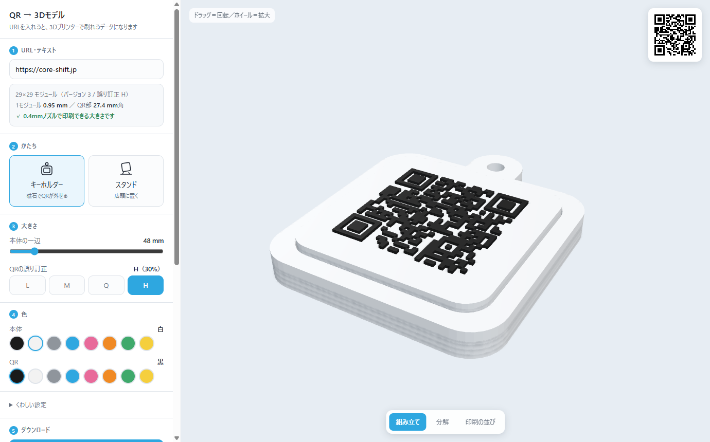

# 3DQR-maker

URL を入れると、**QRコードを立体にした3Dプリント用データ**（3MF / STL）をその場で作れる Webアプリ。
インストールもログインも要りません。

**▶ https://coreshiftforch.github.io/3DQR-maker/**



---

## つくれるもの

### キーホルダー（磁石でQRが外せる・4パーツ）

```
本体 ─── おもて面＋わくが1部品。中は皿状のくぼみ
中ぶた ─┐ 磁石2個にふたをする
QRタイル ┬ 下 ┘ くぼみに落ちて磁石でとまる。ダボ2本でズレない
         └ 上 ─ QRの面
```

QRタイルは磁石で外せるので、**URLを変えたくなったらタイルだけ刷り直せます**。
どのパーツもサポート不要・平置きで刷れます。

### スタンド（店頭に置く・2パーツ）

```
        ／‾‾＼      ← 上辺はドーム
       │ QR │
       │    │
       ╲    │
 ＿＿＿＿ ╲__/       ← 手前の下で曲がって、うしろへ足がのびる
```

プレートも脚も同じ厚み・同じ幅なので、横から見ると**一枚の板が曲がって**見えます。
差しこむだけで組め、接着は要りません。**倒れにくさを毎回計算して出します**。

---

## 使いかた

1. **URL を入れる**（おもて面・うら面の2つ。うら面は空でもOK）
2. **かたち**を選ぶ（キーホルダー／スタンド）
3. **大きさ**を決める。1モジュールが 0.8mm を下回ると警告が出るので、
   出たら書いてある数字まで大きくしてください
4. **レイアウト**で、どの面に何を置くか決める
5. **色**を5つ選ぶ
6. **3MF をダウンロード**してスライサーへ

### レイアウト（面ごとに割りあてる）

| かたち | 面 | 既定 |
|---|---|---|
| キーホルダー | QRタイルのおもて | QR① |
| キーホルダー | QRタイルのうら | QR② |
| キーホルダー | ぜんたいのうら | なし |
| スタンド | プレートのおもて | QR① |
| スタンド | プレートのうら | QR② |

各面に **QR① / QR② / はめ込み（ロゴ） / なし** を選べます。
URLが空ならその面は素のままになるので、「片面だけ」も自然にできます。

### 色は5つ

QR① ／ QR② ／ QRの本体（タイル・プレート）／ 本体（わく・中ぶた・脚）／ ロゴ（はめ込み）。

### はめ込み（ロゴ）

**自分で作った四角柱・円柱がぴったり落ちこむ受け口**を開けられます。
ロゴを乗せた柱を Blender などで作って、それをはめる、という分担です。

- **寸法を決める**（「はめ込むものだけSTL」で下地を落として、そこにロゴを乗せる）か、
  **3Dモデルを読みこむ**（**STL / OBJ / 3MF**）か、どちらでも
- **3MF のマテリアル（フィラメントの色）はそのまま残ります**。
  読みこむと「モデルの色 → 使うフィラメント」が出て、いちばん近い色が自動で選ばれます
- 読みこんだモデルは **+Z がわ（上）が見せたい面**として入ります。
  **ロゴの向き**で 0°／90°／180°／270° に回せて、逆さに作ってあったときは
  **裏返す**で直せます（四角柱を 90°／270° にすると受け口のタテヨコも入れかわります）
- **地続き**にすると、すきま0でぴったり接して**刷ると1つの固まり**になります
  （板と同じ色にすれば継ぎ目も見えません）。
  3MFのなかでも**本体とロゴが1つのオブジェクト**になるので、スライサーで別々になりません。
  **差し替え**にすればあとから交換できます

### まとめ刷り

イベントや店頭配布で数を作るとき用。**セット数**と**プレートの大きさ**を選ぶと、
自動で詰めた3MFが落とせます。入りきらないときはセット数を自動で減らし、
**材料のめやす（g）**も出します。

48mm角のキーホルダーは Bambu P1S に **5セット20部品**、80mmのスタンドは **4セット8部品**まで。

---

## きれいに刷るコツ

- **スライサーで「修復」は要りません**。3MFは頂点をつないだ状態（開いた辺0）で出しています。
  もし修復をうながされたら、それは別の原因なので教えてください
- **誤り訂正は H に固定**しています。3Dプリントは色や影のコントラストが弱く、
  下げると実際に読めなくなりました
- **1モジュール 0.8mm** が 0.4mmノズルの下限。下回ると警告と必要な寸法が出ます
- **QRタイルはQRの面をベッドに向けて**刷ります。ベッド面がいちばん平滑で、
  色の境目も1層目でスパッと決まるのでよく読めます。
  → スライサーの **エレファントフット補正**を入れてください
- **うら面のQR**は「彫りこみ＋色ちがいの詰め物」です。
  AMS等で色を変えて刷ると、ツライチのまま2色になっていちばん読み取りやすくなります
- スタンドの**脚は横倒し**（幅が上下）で刷ります。どの層も同じ断面なのでサポート不要です

---

## 手元で動かす

```
python server.py          →  http://localhost:8080
python server.py 8081     →  ポートを変える
```

Three.js を ES モジュール（importmap）で読むので、**`index.html` をダブルクリックしても動きません**。
かならず上のサーバー経由で開いてください。

---

中身の話（なぜそう作ったか・踏んだ罠）は [NOTES.md](NOTES.md) にあります。
